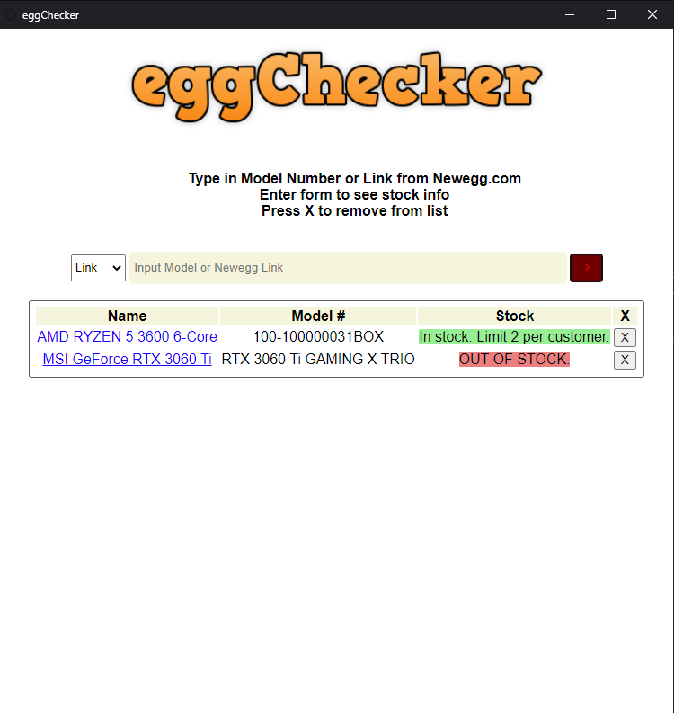

# newegg-product-stock-checker
This is a simple stock checker that uses the beautiful soup python library to retrieve stock information from newegg to a browser gui.

I wrote this program to practice using python, html, and javascript to create a small useful desktop program. The python program uses the beautiful soup library to scrape
NewEgg.com to find the stock information of any product that has a model number. The python functions are accessed by the javascript using the eel library.
Eel also allowed me to write the Gui in html, css and javascript.

The program works but has some bugs. One is that the X buttons do not work to remove a row from the table of products.

Screenshot:   

